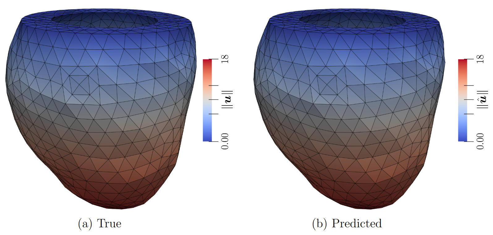

# Physics-Informed Graph Neural Network Emulation of Soft-Tissue Mechanics (CMAME 2023)

Online version: https://www.sciencedirect.com/science/article/pii/S0045782523004759

This repository contains Python scripts to perform the Physics-Informed Graph Neural Network (PI-GNN) emulation experiments as described in the above paper. Please cite this paper if you use the code:

    @article{daltonPIGNN2023,
        title = {Physics-informed graph neural network emulation of soft-tissue mechanics},
        journal = {Computer Methods in Applied Mechanics and Engineering},
        volume = {417},
        pages = {116351},
        year = {2023},
        issn = {0045-7825},
        author = {David Dalton and Dirk Husmeier and Hao Gao},
        keywords = {Soft-tissue mechanics, Graph neural networks, Physics-informed machine learning},
    }



## Environment Setup 

Experiments are performed in Python, using the [JAX](https://github.com/google/jax), [Flax](https://github.com/google/flax) and [Optax](https://github.com/google-deepmind/optax) libraries.

Assuming [conda](https://www.anaconda.com/products/distribution) is installed, a virtual environment with the required packages can be set up using the below shell commands. Firstly, create and activate a new environment.

```
conda create --name pignnEmulationEnv
conda activate pignnEmulationEnv
```

**OPTIONAL** - install [Paraview](https://www.paraview.org/), which is used to create 3D visualisations of the results. 

```
conda install -c conda-forge paraview
```
Finally, use pip to install remaining packages.

```
pip install --upgrade "jax[cuda11_pip]" -f https://storage.googleapis.com/jax-releases/jax_cuda_releases.html
pip install flax
pip install tensorflow
pip install absl-py
pip install -U scikit-learn
```

The specific versions of these packages we used were ``jax 0.4.16`` (``jaxlib 0.4.16+cuda11.cudnn86 ``), ``flax 0.7.4``, ``tensorflow 2.13.0``, ``absl-py 2.0.0`` and ``scikit-learn 1.3.1``. Other required packages, such as [optax](https://github.com/google-deepmind/optax), are installed automatically with the above commands.


#### Warning on Paraview Install

Unfortunately I have found it difficult sometimes to install paraview on Linux, depending on the machine (it generally works fine on Windows). Or sometimes it will install correctly, but then a warning appears when I try to load the ``paraview.simple`` package. For additional installation instructions, see [here](https://anaconda.org/conda-forge/paraview) and [here](https://www.paraview.org/Wiki/ParaView/Python_Scripting). If you cannot get paraview installed correctly, the rest of the code relating to training and evaluating the PIGNN emulator will still work.

## Running Experiments

Various datasets from the manuscript are included in the [``data``](data) subdirectory. Physics-informed training and subsequent evaluation on the test data can then be run by calling [``main.py``](main.py) from the shell. For example, to train for 1000 epochs on the *Liver* model and then predict on the test data, run:

```
python -m main --mode="train_and_evaluate" --data_path="Liver" --n_epochs=1000
```


## Pretrained Emulators 

Pre-trained emulation parameters for the *TwistingBeam*, *Liver* and *LeftVentricle* models are stored in [``emulationResults/trainedParameters``](emulationResults/trainedParameters). Instructions on how to make predictions using these parameters are given in [``PRETRAINED_EMULATORS.md``](PRETRAINED_EMULATORS.md).

## Monitoring Training

[Tensorboard](https://www.tensorflow.org/tensorboard) can be used to monitor training, for example for the *Liver* data by running:
 ```
tensorboard --logdir=emulationResults/Liver
```
and then following the instructions printed to the console.

## Other Comments

* **Varying Input Geometry** - The data handling code in this repository has been written assuming that a **fixed** soft-tissue geometry is of interest. If you wish to model data where the input geometry can vary, see the data handling code in [dodaltuin/passive-lv-gnn-emul](https://github.com/dodaltuin/passive-lv-gnn-emul).
* **Left Ventricle Data**    - The data provided here in [``data/LeftVentricle``](data/LeftVentricle) assumes a fixed blood pressure of 8 mmHg is applied to the inner surface of the LV. This is slightly different to the model considered in the paper, where the blood pressure varied in the range [4,10] mmHg. The data handling code had been written assumed that pressure would be fixed. During the revision process, a reviewer asked us to consider emulation of the *LeftVentricle* model where the pressure value varies. To account for varying pressure values, we made use of an adjustment which breaks generalisability of the code, so we do not make it public. The results in either case are almost identical.

## Directory Layout

## Files:

### [``main.py``](main.py)

Main script to call PI-GNN emulation

### [``models.py``](models.py)

Implements *PrimalGraphEmulator* GNN emulation architecture

### ``utils_*``

Various script containing utility functions for data handling, potential energy evaluation, model training, etc

### [``PRETRAINED_EMULATORS.md``](PRETRAINED_EMULATORS.md)

Details how predictions can be made using pre-trained emulation parameters

## Subdirectories:

### [``data``](data)

Stores data on each model (such as geometry, constitutive law, etc) and test simulation data generated using [FEniCS](https://fenicsproject.org/) used for evaluating of emulation performance. See the  [``data/README.md``](data/README.md) file for further details

### [``emulationResults``](emulationResults)

Stores the trained emulator parameters and predictions.
